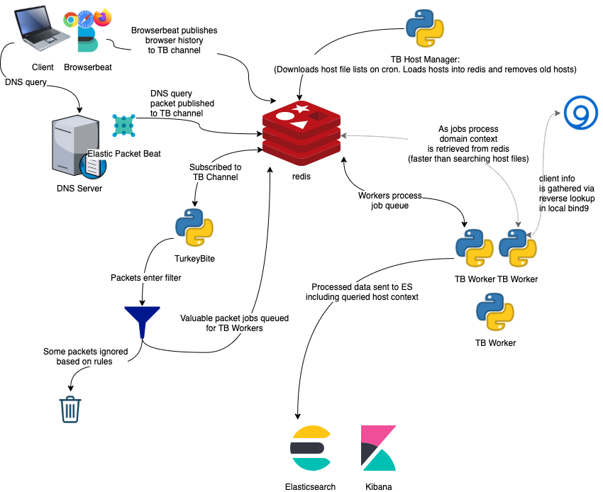

# TurkeyBite

[](https://github.com/MelonSmasher/TurkeyBite/blob/master/LICENSE)


## What is TurkeyBite

A domain and host context analysis pipeline.

TurkeyBite analyzes client network traffic to glean some context into each request. TB allows you to identify clients who are requesting domains associated with anything from porn to gambling to shopping and everything in between.

### Whats under the hood

TurkeyBite relies on the following technologies

*   Docker
*   Python3
*   Valkey
*   Bind9
*   [Packetbeat](https://www.elastic.co/products/beats/packetbeat) and/or [Browserbeat](https://github.com/MelonSmasher/browserbeat)
*   OpenSearch
*   OpenSearch Dashboards
*   Domain and host lists from many sources

In practice the analysis pipeline looks like this:



### What DNS servers does this work with

As of right now I have tested this with a Microsoft DNS server and I am running this in production with multiple Bind9 servers. Since Packetbeat is used to grab and send packets to Redis this should work with any DNS server that can also run Packetbeat.

### What browsers does this work with

Any browsers that [Browserbeat](https://github.com/MelonSmasher/browserbeat) supports should work with TurkeyBite.

### Will this block clients

Short answer: no.

Long answer: TB is an analysis tool not a blocking tool. For something like that check out [pi-hole](https://pi-hole.net/). In theory there is no reason why you couldn't run both pi-hole and TB in tandem. TB is designed to be as unobtrusive as possible so that it's implementation impact is never felt by clients.

## Setup

### Prerequisites

* Docker and Docker Compose installed on your host system
* Git to clone the repository

### Installation

1. **Clone the repository**

   ```bash
   git clone https://github.com/MelonSmasher/TurkeyBite.git
   cd TurkeyBite
   ```

2. **Initialize the project**

   Run the setup script to create required directories and configuration files:

   ```bash
   bash setup.sh
   ```

   The setup script will guide you through configuration options including:
   
   - Deployment type (Development, Small Scale, or Full Scale)
   - DNS lookup configuration for client IPs
   - Output options (OpenSearch and/or Syslog)
   - Service passwords and connection settings
   
   For distributed deployments, you'll run this script on each node with the appropriate configuration.

3. **Review configuration (optional)**

   The setup script automatically generates the following configuration files:

   - `.env` - Environment variables for Docker containers
   - `config.yaml` - TurkeyBite application configuration
   - `docker-compose.yml` - Container orchestration configuration

   While the setup script configures these files based on your selections, you can review and adjust them if needed:

   **Environment Variables** in `.env`:

   ```bash
   # Key environment variables (automatically configured by setup)
   OPENSEARCH_INITIAL_ADMIN_PASSWORD=******      # Password for OpenSearch admin
   OPENSEARCH_HOSTS='["https://opensearch:9200"]'  # OpenSearch connection URL array
   VALKEY_HOST=valkey                            # Valkey/Redis hostname or IP
   VALKEY_PORT=6379                             # Valkey/Redis port
   OPENSEARCH_PORT=9200                         # OpenSearch API port
   OPENSEARCH_DASHBOARD_PORT=5601               # OpenSearch Dashboards port
   BIND9_IP=172.172.0.100                       # Static IP for Bind9 in Docker network
   TURKEYBITE_WORKER_PROCS=2                    # Number of worker processes
   TURKEYBITE_HOSTS_INTERVAL_MIN=720            # Host list refresh interval (minutes)
   TURKEYBITE_IGNORELIST_INTERVAL_MIN=5         # Ignorelist refresh interval (minutes)
   ```
   
   **Application Configuration** in `config.yaml`:

   ```yaml
   redis:
     host: ${VALKEY_HOST}
     port: ${VALKEY_PORT}
     password: your_password_from_secrets
     db: 0
     host_list_db: 1
     channel: packetbeat
   # ... other configuration sections
   ```

4. **Secrets Setup**

   The setup script automatically creates the required password files in the `vols/secrets/` directory. These include:

   - `valkey_password.txt` - Password for Valkey/Redis authentication

   You can review and modify these secrets if needed.

   **Important for Distributed Setups:** In distributed deployments where Valkey runs on its own dedicated node, the `valkey_password.txt` file must be copied from the Valkey server to all Core and Worker nodes. The setup script will prompt you to enter this password when configuring nodes that don't run Valkey directly.

5. **Configure Bind9 (if using as DNS server)**

   The setup script copies example Bind9 configuration files to the `vols/bind/` directory. Review and modify these files:
   
   * `named.conf.local` - Local DNS configuration
   * `named.conf.options` - DNS server options
   * `slave.conf` - Zone configurations for slave DNS setup

   For more information on Bind9 configuration see [docs/bind9.md](docs/bind9.md).

### Running TurkeyBite

1. **Start the containers**

   ```bash
   docker compose up -d
   ```

2. **Verify containers are running**

   ```bash
   docker compose ps
   ```

3. **Access OpenSearch Dashboards**

   Navigate to `http://localhost:5601` in your web browser
   
   * Username: `admin`
   * Password: The password you set in `OPENSEARCH_INITIAL_ADMIN_PASSWORD`

### Data Collection

To collect network data, you'll need to configure either Packetbeat or Browserbeat:

1. **Packetbeat**

   Install and configure [Packetbeat](https://www.elastic.co/products/beats/packetbeat) on your network:

   ```yaml
   # packetbeat.yml example
   packetbeat.protocols:
     dns:
       ports: [53]
       include_authorities: true
       include_additionals: true
   
   output.redis:
     hosts: ["${VALKEY_HOST}:${VALKEY_PORT}"]
     password: "your_valkey_password"
     db: 0
     key: "packetbeat"
     data_type: "list"
   ```

2. **Browserbeat**

   Follow the installation instructions for [Browserbeat](https://github.com/MelonSmasher/browserbeat) to collect browser history data.

### Maintenance

* **Logs**: Container logs are available in the `vols/logs/` directory
* **Domain Lists**: Lists are stored in `vols/lists/` and updated according to the configured intervals

### Troubleshooting

* Check container logs: `docker compose logs -f [service_name]`
* Restart services: `docker compose restart [service_name]`
* Verify connectivity between containers: `docker compose exec turkeybite-core ping valkey`