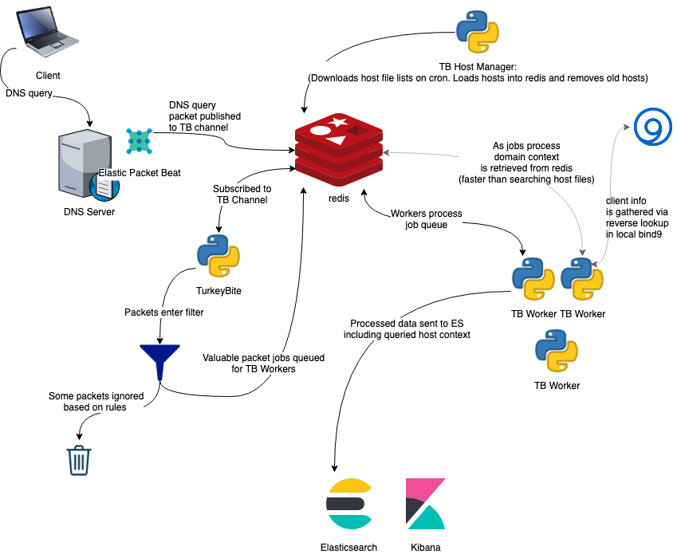

# TurkeyBite

## What is TurkeyBite

A domain and host context analysis pipeline.

TurkeyBite analyzes client network traffic to glean some context into each request. TB allows you to identify clients who are requesting domains associated with anything from porn to gambling to shopping and everything in between.

### Whats under the hood

TurkeyBite relies on the following technologies

*   Python3
*   Redis
*   Bind9
*   [Packetbeat](https://www.elastic.co/products/beats/packetbeat) and/or [Browserbeat](https://github.com/MelonSmasher/browserbeat)
*   Elasticsearch
*   Kibana
*   Domain and host lists from many sources

In practice the analysis pipeline looks like this:

### What DNS servers does this work with

As of right now I have tested this with a Microsoft DNS server and I am running this in production with multiple Bind9 servers. Since Packetbeat is used to grab and send packets to Redis this should work with any DNS server that can also run Packetbeat.

### What browsers does this work with

Any browsers that [Browserbeat](https://github.com/MelonSmasher/browserbeat) supports should work with TurkeyBite.

### Will this block clients

Short answer: no.

Long answer: TB is an analysis tool not a blocking tool. For something like that check out [pi-hole](https://pi-hole.net/). In theory there is no reason why you couldn't run both pi-hole and TB in tandem. TB is designed to be as unobtrusive as possible so that it's implementation impact is never felt by clients.

## Setup

### Linux

[Ubuntu Instructions](docs/ubuntu_linux_install.md)

### Docker

WIP - coming soon
