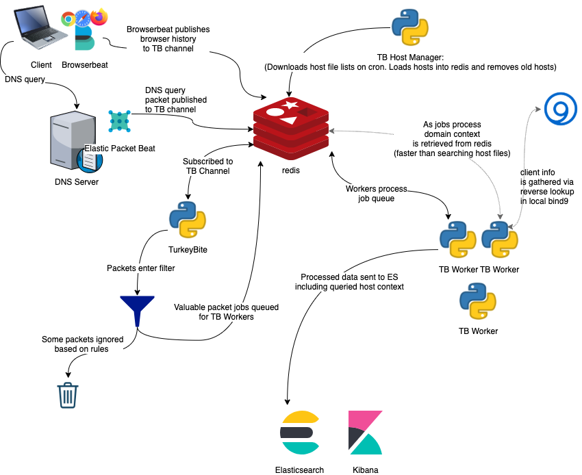

# TurkeyBite

[](https://github.com/MelonSmasher/TurkeyBite/blob/master/LICENSE)


## What is TurkeyBite

A domain and host context analysis pipeline.

TurkeyBite analyzes client network traffic to glean some context into each request. TB allows you to identify clients who are requesting domains associated with anything from porn to gambling to shopping and everything in between.

### Whats under the hood

TurkeyBite relies on the following technologies

*   Docker
*   Python3
*   Valkey
*   Bind9
*   [Packetbeat](https://www.elastic.co/products/beats/packetbeat) and/or [Browserbeat](https://github.com/MelonSmasher/browserbeat)
*   OpenSearch
*   OpenSearch Dashboards
*   Domain and host lists from many sources

In practice the analysis pipeline looks like this:



When conceptualizing the diagram above replace redis, elasticsearch, and kibana with valkey, opensearch, and opensearch dashboards respectively.

### What DNS servers does this work with

As of right now I have tested this with a Microsoft DNS server and I am running this in production with multiple Bind9 servers. Since Packetbeat is used to grab and send packets to Redis this should work with any DNS server that can also run Packetbeat.

### What browsers does this work with

Any browsers that [Browserbeat](https://github.com/MelonSmasher/browserbeat) supports should work with TurkeyBite.

### Will this block clients

Short answer: no.

Long answer: TB is an analysis tool not a blocking tool. For something like that check out [pi-hole](https://pi-hole.net/). In theory there is no reason why you couldn't run both pi-hole and TB in tandem. TB is designed to be as unobtrusive as possible so that it's implementation impact is never felt by clients.

## Setup

### Prerequisites

* Docker and Docker Compose installed on your host system
* Git to clone the repository

### Installation

1. **Clone the repository**

   ```bash
   git clone https://github.com/MelonSmasher/TurkeyBite.git
   cd TurkeyBite
   ```

2. **Initialize the project**

   Run the setup script to create required directories and configuration files:

   ```bash
   bash setup.sh
   ```

   The setup script will guide you through configuration options including:
   
   - Deployment type (Development, Small Scale, or Full Scale)
   - DNS lookup configuration for client IPs
   - Output options (OpenSearch and/or Syslog)
   - Service passwords and connection settings
   
   For distributed deployments, you'll run this script on each node with the appropriate configuration.

3. **Review configuration (optional)**

   The setup script automatically generates the following configuration files:

   - `.env` - Environment variables for Docker containers
   - `config.yaml` - TurkeyBite application configuration
   - `docker-compose.yml` - Container orchestration configuration

   While the setup script configures these files based on your selections, you can review and adjust them if needed:

   **Environment Variables** in `.env`:

   ```bash
   # Key environment variables (automatically configured by setup)
   OPENSEARCH_INITIAL_ADMIN_PASSWORD=******      # Password for OpenSearch admin
   OPENSEARCH_HOSTS='["https://opensearch:9200"]'  # OpenSearch connection URL array
   bootstrap.memory_lock=true                     # Enable memory locking for OpenSearch
   node.name=${OPENSEARCH_HOST}                  # Set node name to match host
   discovery.type=single-node                    # Run in single node mode
   OPENSEARCH_JAVA_OPTS=-Xms512m -Xmx512m        # Configure Java memory limits
   VALKEY_HOST=valkey                            # Valkey/Redis hostname or IP
   VALKEY_PORT=6379                             # Valkey/Redis port
   OPENSEARCH_PORT=9200                         # OpenSearch API port
   OPENSEARCH_DASHBOARD_PORT=5601               # OpenSearch Dashboards port
   BIND9_IP=172.172.0.100                       # Static IP for Bind9 in Docker network
   TURKEYBITE_WORKER_PROCS=2                    # Number of worker processes
   TURKEYBITE_HOSTS_INTERVAL_MIN=720            # Host list refresh interval (minutes)
   TURKEYBITE_IGNORELIST_INTERVAL_MIN=5         # Ignorelist refresh interval (minutes)
   ```
   
   **Application Configuration** in `config.yaml`:

   ```yaml
   redis:
     host: valkey
     port: 6379
     password: your_password_from_secrets
     db: 0
     host_list_db: 1
     channel: turkeybite
   # ... other configuration sections
   ```

4. **Secrets Setup**

   The setup script automatically creates the required password files in the `vols/secrets/` directory. These include:

   - `valkey_password.txt` - Password for Valkey/Redis authentication

   You can review and modify these secrets if needed.

   **Important for Distributed Setups:** In distributed deployments where Valkey runs on its own dedicated node, the `valkey_password.txt` file must be copied from the Valkey server to all Core and Worker nodes. The setup script will prompt you to enter this password when configuring nodes that don't run Valkey directly.

5. **Configure Bind9 (if using as DNS server)**

   The setup script copies example Bind9 configuration files to the `vols/bind/` directory. Review and modify these files:
   
   * `named.conf.local` - Local DNS configuration
   * `named.conf.options` - DNS server options
   * `slave.conf` - Zone configurations for slave DNS setup

   For more information on Bind9 configuration see [docs/bind9.md](docs/bind9.md).

### Running TurkeyBite

1. **Start the containers**

   ```bash
   docker compose up -d
   ```

2. **Verify containers are running**

   ```bash
   docker compose ps
   ```

3. **Access OpenSearch Dashboards**

   Navigate to `http://localhost:5601` in your web browser
   
   * Username: `admin`
   * Password: The password you set in `OPENSEARCH_INITIAL_ADMIN_PASSWORD`

### Data Collection

To collect network data, you'll need to configure either Packetbeat or Browserbeat:

1. **Packetbeat**

   Install and configure [Packetbeat](https://www.elastic.co/products/beats/packetbeat) on your network:

   ```yaml
   # packetbeat.yml example
   packetbeat.protocols:
     dns:
       ports: [53]
       include_authorities: true
       include_additionals: true
   
   output.redis:
     hosts: ["valkey.domain.com:6379"]
     password: "your_valkey_password"
     db: 0
     key: "turkeybite"
     datatype: "list"
   ```

   `datatype` has to match the ingestion path you run, and they are not
   interchangeable. `key` must match `redis.channel` in `config.yaml`, which is
   `turkeybite` by default, whichever path you choose.

   Note the spelling: libbeat reads `datatype`, with no underscore. A key
   spelled `data_type` is not recognised, so the output silently falls back to
   its default of `list` no matter what value you give it.

   **`list`, with `TURKEYBITE_PIPELINE=consume`.** Packetbeat RPUSHes onto a
   Valkey list. Workers claim a batch, sieve and enrich it, index it, and only
   then acknowledge. The list persists, so a restart resumes instead of losing
   what was in flight, `LLEN` gives you a real backlog metric, and a burst makes
   the list grow visibly rather than disappearing. Delivery is at-least-once, so
   a crash between indexing and acknowledging can duplicate a batch.

   **`channel`, with `TURKEYBITE_PIPELINE=rq`.** Packetbeat PUBLISHes and the
   core subscribes. This is the original path and it is lossy by construction:
   pub/sub has no persistence and no acknowledgement, so every restart drops
   whatever was in flight, and when the single subscriber falls behind a burst
   Valkey disconnects it at the 32 MB output-buffer limit with no error and no
   counter.

   Get this wrong in either direction and you get a healthy-looking Packetbeat,
   a Valkey key nothing reads, and no events analysed.

2. **Browserbeat**

   Follow the installation instructions for [Browserbeat](https://github.com/MelonSmasher/browserbeat) to collect browser history data.

### Maintenance

* **Logs**: Container logs are available in the `vols/logs/` directory
* **Domain Lists**: Lists are stored in `vols/lists/` and updated according to the configured intervals

### Troubleshooting

* Check container logs: `docker compose logs -f [service_name]`
* Restart services: `docker compose restart [service_name]`
* Verify connectivity between containers: `docker compose exec turkeybite-core ping valkey`

## How traffic is categorised

Every category comes from a domain list, and every list is wrong about something. Asserting whatever any list says adds up the mistakes of all of them: measured against the 10,000 most popular domains, that rule called 291 of them malicious, including coinbase.com, uvm.edu, every site on workers.dev and every site under com.cn. In `index` mode three rules stop that. The `valkey` mode predates them and applies none of them.

**An entry reaches only as far as its list says.** A hosts-file line names one host. An adblock `||example.com^` rule, a `*.example.com` line and a squid-style `.example.com` cover the subdomains too. A plain domain list does not say, so its entry in `host_files.json` does, with `match`. Your own `turkeybite` and `custom` lists always cover subdomains.

**Nothing speaks for a domain it does not own.** Above a domain's registrable name, as the [Public Suffix List](https://publicsuffix.org/) defines it, a parent belongs to someone else. A downloaded list naming `github.io`, `workers.dev` or `com.cn` says nothing about the sites hosted under them. Only your own lists can make a rule that broad, which is how `*.edu` and `*.gov` keep working.

**A category needs evidence.** Each list in `host_files.json` declares how far it is trusted:

| Field | Meaning |
|---|---|
| `trust` | `high` is believed alone: narrow vendor lists, and your own lists. `medium` is believed when another independent publisher agrees. `low` is never believed, only recorded. Default `medium`. |
| `publisher` | Who maintains the list. Lists from one publisher share their mistakes, so they never corroborate each other. Default: the list's own name. |
| `derived_from` | Publishers whose lists this one copies. A copy never corroborates its original. |
| `match` | For plain domain lists only: `exact` if a line names one host, `subtree` if it covers subdomains. Default `exact`. |

A list file that `host_files.json` does not mention, other than your own `turkeybite` and `custom` lists, is read at `low` trust: recorded on events, never believed. That is usually a download whose entry has since been removed, since the file stays on disk. Block List Project's thirteen lists were removed from `host_files.example.json` because they never decided a category, cost half of every download and more than half of the index, and had stopped updating; if you used them, their `blocklistproject-*` files are still under `vols/lists` and you can delete them. The librarian names every such file each time it builds the index.

Sources agree when their categories mean the same thing, which is decided by the taxonomy behind `bite.purpose`, `bite.service` and `bite.risk` rather than by spelling. StevenBlack's `fake-news` and the local list's `fakenews` corroborate each other, as do `signal` and `whispersystems`. A vendor category says two things, `steam` that the host is Steam and that it is a game storefront, and is believed only when both are supported: a list saying `steam` and another saying `epicgames` agree on the second and not the first, so neither is asserted. Events keep the categories as the lists spelled them.

The number of independent publishers a `medium` category needs is `processor.evidence.min_publishers` in `config.yaml`, 2 by default. It can also be set per taxonomy branch or path, the names `bite.purpose` and `bite.risk` use, as in `{default: 2, threat: 1}`. The most specific key wins. Keys are taxonomy paths rather than category names so that every spelling of one judgement gets the same bar; a key the taxonomy does not know stops the worker at start. Lowering the bar brings false positives back: `threat: 1` takes the Tranco top 10,000 domains carrying a threat category from 5 to 57. Events carry:

* `bite.contexts` the categories the evidence supports, which the facets are built from
* `bite.contexts_candidate` categories some list claimed without enough support
* `bite.contexts_suppressed` categories your ignorelist cancelled
* `bite.claims` which list said what, as `category:list`
* `bite.incidental` true when the name looked up is marked incidental, see below

Whole categories can be switched off with `processor.evidence.disabled_categories`, a list of taxonomy branches or paths, without deleting the lists that carry them. A disabled category is dropped before anything is weighed, so it appears nowhere on the event, including `bite.claims` and `bite.contexts_suppressed`: the usual reason to switch one off is that its label should not be stored against the people whose traffic it matches.

The `editorial` branch is off by default. It covers the `fakenews`, `fascist` and `zionist` lists and StevenBlack's `fake-news`, which label news and opinion sites by viewpoint, and leaving the key out of `config.yaml` means `[editorial]`. A list you write replaces the default rather than adding to it, so `disabled_categories: []` switches the editorial lists back on, and `[editorial, adult.gambling]` keeps them off and gambling too. `turkeybite audit --disable` does the same for one run, and `--disable ""` switches nothing off.

A new index format carries this, so upgrading needs a rebuild. The librarian does that when it starts, or run `python turkeybite index`.

### Incidental lookups

A DNS lookup is not always a choice. A news article with a Facebook pixel makes the browser look up `connect.facebook.net`; Windows looks up `msftconnecttest.com` whenever it joins a network; signing in to Gmail visits `accounts.youtube.com`. None of those says the person used Facebook or YouTube. The curated list [`vols/lists/incidental/turkeybite`](vols/lists/incidental/turkeybite) names hosts like these: social plugins, pixels and embedded players that other sites load, connectivity checks, and sign-in endpoints. It only names hosts that are looked up mostly on someone else's behalf and that are not the service's own site, so `www.youtube.com` is not on it and `youtube-nocookie.com`, which exists only for embeds, is.

On a marked host the categories that say what a host is for or whose service it is, those under `bite.purpose` and `bite.service`, become candidates, and the event carries `bite.incidental: true`. Risk categories stay asserted: the pixel tracks the person whether or not they use Facebook. The mark reaches the CNAME chain too. `connect.facebook.net` is hosted on `scontent.xx.fbcdn.net`, which every Facebook list names, so what the chain contributes to a marked name is demoted the same way; and a name whose chain passes through a marked host gets no purpose or service from that chain, though its own categories stand. It applies to browser history events as well, and like everything in this section only in `index` mode: the `valkey` loader skips the list. To lift the mark from a host, add it under `incidental` in your [ignorelist](vols/lists/ignorelist.md).

### Finding false positives

`turkeybite audit` runs a reference list of domains through exactly the code the workers use and reports what it would assert. The [Tranco list](https://tranco-list.eu/) of popular domains is a good reference:

```bash
curl -L -o top-1m.csv.zip https://tranco-list.eu/top-1m.csv.zip
unzip -o top-1m.csv.zip -d vols/lists
docker compose exec turkeybite-worker python turkeybite audit lists/top-1m.csv --top 10000
```

`vols/lists` is mounted into the worker as `lists`. A file directly inside it is not read as a domain list; only files in its subdirectories are.

Popular is not the same as harmless, so read the report rather than trusting it: popular sites really are social networks, and some really are adult. A threat category on a top 10,000 domain is a different matter, and the report names the lists behind every one. Then either correct the host in the [ignorelist](vols/lists/ignorelist.md), or, if one list keeps appearing, lower its `trust`.

Corroboration is only worth something between independent lists, and `derived_from` is the only record of which lists copy which. `turkeybite overlap` reads the index and reports every pair of lists where one holds at least half of the other's names, marking with `!` the pairs that are weighed as independent although their agreement may be one opinion counted twice. It also measures each declared `derived_from` against the lists it names. A heavy overlap is a reason to read the publishers' documentation, not proof of copying: two good lists of popular gambling sites will overlap because there are only so many popular gambling sites.
