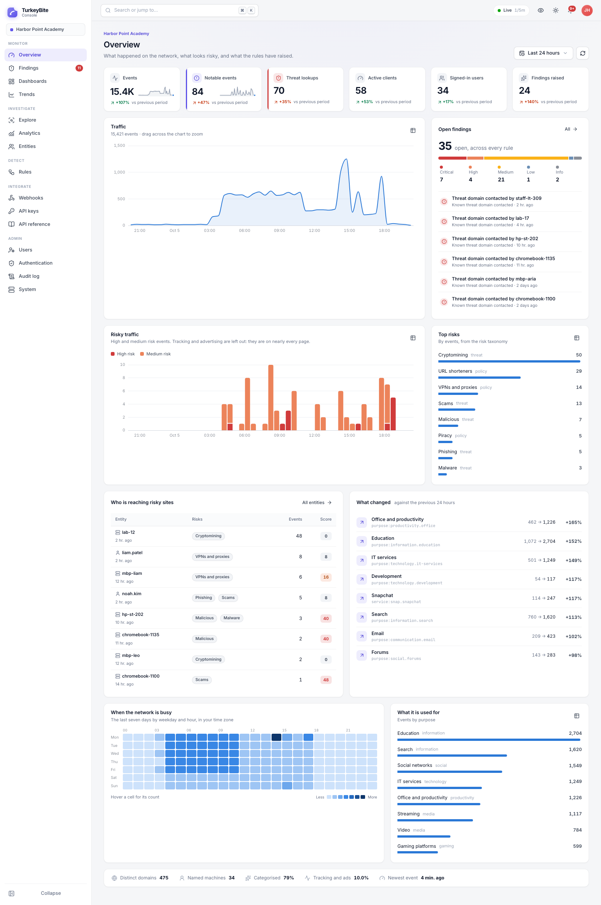

# TurkeyBite Console

A single-page app and API for TurkeyBite, to replace OpenSearch Dashboards: search
every lookup and page visit, take any question apart with analytics, see people
and domains in one place, and let a rule-driven analysis layer raise findings and
send them where they need to go.



More, rendered from the running app with made-up data: [overview, dark](docs/screenshots/overview-dark.png),
[an event explained](docs/screenshots/explore-event-dark.png), [analytics](docs/screenshots/analytics-light.png),
[a person's profile](docs/screenshots/entity-profile-dark.png), [the same in privacy mode](docs/screenshots/entity-profile-privacy-light.png),
[findings](docs/screenshots/findings-light.png), [a finding](docs/screenshots/finding-detail-light.png),
[rules](docs/screenshots/rules-light.png), [a rule and its backtest](docs/screenshots/rule-editor-backtest-light.png),
[a dashboard](docs/screenshots/dashboard-security-dark.png), [trends](docs/screenshots/trends-light.png),
[webhooks](docs/screenshots/webhooks-light.png), [system](docs/screenshots/system-dark.png),
[the command palette](docs/screenshots/command-palette-dark.png) and [sign-in](docs/screenshots/login-light.png).

It runs on its own server, away from the TurkeyBite cluster. Events stay in
OpenSearch (or Elasticsearch), which the console only ever reads. The console
keeps its own records in Postgres: accounts and sessions, API keys, rules and
the findings they raise, webhooks and their deliveries, dashboards, the audit
log, and daily counts for long-term trends. Nothing in Postgres is a copy of an
event: a finding keeps the query that reproduces its evidence, and the daily
counts are per day and category, never per person.

## What it does

| | |
|---|---|
| **Overview** | Traffic, risky traffic by severity, top risks and purposes, who is reaching risky sites with a risk score, what changed against the previous period, and the weekly rhythm of the network. Drag across any chart to zoom. |
| **Explore** | TBQL search with syntax colouring, field and value suggestions, and mistakes underlined where they are made. A histogram split by risk or type, a field sidebar to pivot on any value, chosen columns, a live tail, saved searches, and CSV or NDJSON export. Every event opens to say who, what, and *why it is categorised as it is*: which lists agree, which only claimed it, which the ignorelist cancelled. |
| **Analytics** | Count events or distinct values by any field, split by another, or over time; as bars, stacked bars, a table, areas, lines or a single number. Every answer links back to its events and can be put on a dashboard. |
| **Entities and domains** | A profile for each person, machine or address: identities seen together, activity by risk, domains, purposes, findings, their hours, and recent risky events. A profile for each domain: the evidence behind its categories, DNS, who reached it, and findings that mention it. Every profile view is audited. |
| **Findings** | A triage queue: severity, status, owner, bulk actions, and per finding the evidence re-read live from OpenSearch, an activity trail with comments, alerts sent, and one click to mark a false positive *and teach its rule an exception*. |
| **Rules** | The analysis layer. Six rule types (threshold, distinct values, ratio, spike, first seen, silence), grouped per person or machine, with schedules, exceptions, re-alert gaps and webhook routing. Twenty built-in rules ship ready to enable, disable, tune, clone or reset. A backtest shows what a rule would have raised before it is switched on. |
| **Dashboards and trends** | Dashboards of live widgets, three built in. Trends from the daily counts, which outlive index retention. |
| **Webhooks** | Slack, Microsoft Teams, Discord, Google Chat, or signed JSON. Deliveries are queued in Postgres, retried with backoff, and can be sent again by hand. Identities can be redacted per webhook. |
| **Access** | LDAP sign-in with group-to-role mapping, local accounts that keep working when the directory does not, TOTP second factor, service accounts and scoped API keys, three roles, and an audit log of who looked at what. |
| **Look and feel** | Light, dark and system themes, six accents, compact density, a ⌘K command palette, and privacy mode, which shows people as stable aliases for a shared screen. |

## Deploying

```sh
cd console
cp console.env.example console.env    # fill in the secret key, passwords and OpenSearch
docker compose --env-file console.env up -d --build
```

Then sign in as the bootstrap admin from `console.env`, change its password,
turn on its second factor, and remove `TBCONSOLE_BOOTSTRAP_ADMIN_PASSWORD`. Put
TLS in front of port 8710 with your usual reverse proxy; the console sets Secure
cookies and HSTS and expects https. Behind a proxy, set
`TBCONSOLE_FORWARDED_ALLOW_IPS` to the proxy's own address, so the audit log and
the sign-in limits see people's addresses rather than the proxy's. Trust
nothing wider: any address listed there may claim to be anyone. With
`docker-compose.yml` and a proxy on the host, connections arrive from the
compose network's gateway, `172.31.213.1`, which is what `console.env.example`
trusts; if that subnet is in use where you are, change it in both files. An
address that is not an IP address is never stored or trusted.

The image migrates its database at start. Any number of replicas can run:
migrations and the sync of built-in rules take a Postgres advisory lock in
turn; the rule scheduler and webhook dispatcher claim their work with
`SELECT ... FOR UPDATE SKIP LOCKED`, a running rule holds a lease that lapses
if its process dies, and the daily rollups and housekeeping hold a lease, so
nothing runs twice. Set `TBCONSOLE_RUN_WORKERS=false` on replicas that should
only serve.

Housekeeping runs hourly: it deletes ended sessions, sent or abandoned webhook
deliveries after `TBCONSOLE_DELIVERY_RETENTION_DAYS`, findings closed for longer
than `TBCONSOLE_FINDING_RETENTION_DAYS` and audit events older than
`TBCONSOLE_AUDIT_RETENTION_DAYS` (a year each by default; 0 keeps them). It also
looks up, by its directory entry, every directory account that still has a
session or an API key, so someone removed from the directory, from every group
that grants a role, or no longer matched by the sign-in filter (a disabled
Active Directory account, if the filter says so) loses access within
`TBCONSOLE_LDAP_RECHECK_MINUTES` rather than when their session ends, and a
changed group changes their role. A directory that does not answer clearly
(busy, unreachable, refusing the search) changes nothing, an account it gives
no clear answer about is left as it is, and a recheck that would revoke more
than a fifth of the enabled accounts it looked at, and more than three,
revokes none and logs why: that is far likelier a settings mistake than a
mass departure.
Accounts the directory took away are given back when it grants them again;
an administrator's disabling is not.

To change `TBCONSOLE_SECRET_KEY`, put the old key in
`TBCONSOLE_SECRET_KEY_PREVIOUS`, restart, run `python -m tbconsole reencrypt`,
which encrypts every stored secret again under the new key, then remove the
old one.

### A read-only account for OpenSearch

The console never writes to the cluster. Give it an account that can only read
TurkeyBite's indices. With the OpenSearch security plugin:

```sh
curl -u admin --cacert root-ca.pem -X PUT https://opensearch:9200/_plugins/_security/api/roles/tbconsole_reader \
  -H 'Content-Type: application/json' -d '{
    "cluster_permissions": ["cluster_monitor"],
    "index_permissions": [{ "index_patterns": ["tb-index-*"],
                            "allowed_actions": ["read", "indices_monitor"] }]
  }'
curl -u admin --cacert root-ca.pem -X PUT https://opensearch:9200/_plugins/_security/api/internalusers/tbconsole_reader \
  -H 'Content-Type: application/json' -d '{ "password": "…", "backend_roles": [], "opendistro_security_roles": ["tbconsole_reader"] }'
```

On Elasticsearch, a role with `monitor` on the cluster and `read`,
`view_index_metadata` and `monitor` on `tb-index-*` does the same.

### Signing in with LDAP

Under **Admin → Authentication**, give the directory's `ldaps://` URLs (or
`ldap://` with StartTLS), a service account that can search people, where to
search and with what filter, and map directory groups to roles. A person gets the
highest role any of their groups maps to, read again at every sign-in; someone
in no mapped group is refused unless a default role is set. **Try it** checks
each step with a real username, and says where it fails.

A username that belongs to a local account always signs in locally, whether the
directory is up or not; that is what local accounts are for. Five wrong
passwords or codes lock a local account for fifteen minutes
(`TBCONSOLE_LOGIN_MAX_FAILURES`, `TBCONSOLE_LOGIN_LOCKOUT_MINUTES`), ten failures
for one username from one address hold that pair back for five minutes, an
address with a hundred failures in five minutes is held back for the names it
has failed with but never for one it has not tried, and admins can require a
second factor for local admins. Each address has two sign-ins checked at a
time and a queue of 64 behind them, past which it is told to try again in a
moment, so a flood from one address waits on itself while every other
address signs in as usual; the directory being unreachable never counts
against anyone's name. Someone who lost their
authenticator gets back in with
`python -m tbconsole create-user NAME --password-stdin --reset-mfa`, which also
ends their sessions; their role stays as it was unless `--role` is given, a
disabled account stays disabled unless `--enable` is, and `--revoke-keys`
revokes every API key it holds, for a reset after a compromise; an admin
setting a new password on Users can revoke the keys too. Wrong passwords given
to confirm a change on the account page count against the same limits as
sign-ins, and lock the account the same way, and a sign-in from another site's
page is refused.

## Rules

A rule is a TBQL query, which picks the events in scope, and a type, which says
what about them is worth a finding:

| Type | Fires when | Example |
|---|---|---|
| Threshold | at least N matching events in the window | adult content, threats |
| Distinct values | at least N distinct values of a field | 300 distinct names under one domain: tunnelling |
| Ratio | a share of the events also match a second query | most lookups failing: a domain generator |
| Spike | far more events than the same window usually holds | a machine suddenly ten times as busy |
| First seen | a value not seen for N days before | a risky domain nobody had contacted |
| Silence | events stop | TurkeyBite itself stops sending events |

Each rule raises at most one open finding per person or machine (or per value,
for first seen): a rule that keeps matching adds occurrences to it, and its
re-alert gap decides when a reminder goes out. Exceptions take events out of
a rule's scope, and expire on their own if given a date. A schedule limits a rule
to certain hours, wrapping midnight when it ends before it starts.

The built-in rules read TurkeyBite's taxonomy facets (`bite.risk`,
`bite.purpose`) rather than raw category names, so a new list that spells a
judgement differently is covered without editing a rule. Incidental lookups are
left out wherever a rule is about what a person chose to do.

| Rule | Type | Severity | On |
|---|---|---|---|
| Known threat domain contacted | Threshold | Critical | yes |
| Fraud or scam site | Threshold | Medium | yes |
| Cryptomining | Threshold | High | yes |
| Possible DNS tunneling | Distinct values | High | yes |
| Failed-lookup storm | Ratio | High | yes |
| Risky domain seen for the first time | First seen | Medium | yes |
| Encrypted DNS bypass | Threshold | High | yes |
| VPN or proxy use | Threshold | Medium | yes |
| Adult content | Threshold | High | yes |
| Gambling | Threshold | Medium | yes |
| Drug sites, Piracy and torrents, Dating apps, Generative AI tools | Threshold | Medium to info | no |
| After-hours browsing | Threshold, scheduled | Low | no |
| Unusual burst of activity | Spike | Medium | yes |
| Spike in risky traffic | Spike | High | yes |
| New kind of site for someone | First seen | Info | no |
| TurkeyBite stopped sending events | Silence | Critical | yes |
| A browser agent went quiet | Silence | Low | no |

Built-in rules can be changed but not deleted. A changed one keeps its changes
when the console upgrades and is marked as having an update available; **Reset**
brings back the shipped definition.

## TBQL

```
youtube.com                     a domain, host, user or category
domain:*.tiktok.com             wildcards, case-insensitive
risk:threat                     threat and everything under it in the taxonomy
client:10.20.0.0/16             addresses and networks
rcode:NXDOMAIN AND NOT type:browser.history
category:(porn OR gambling)     several values of one field
-incidental:true                minus for NOT
has:user                        the field has a value
@timestamp:>now-1h              comparisons: > >= < <=
client:[10.0.0.1 TO 10.0.0.99]  ranges, {exclusive}
```

Fields have short names (`domain`, `site`, `user`, `host`, `client`, `category`,
`purpose`, `risk`, `severity`, `rcode`, `type`…); the field sidebar in Explore
lists them all. A query is parsed by the console and checked against its list
of fields before anything reaches OpenSearch, so it cannot reach a field, index
or script the console does not offer.

## The API

Everything the app does goes through `/api/v1`, described at
`/api/openapi.json` and on the app's API reference page. Set
`TBCONSOLE_API_DOCS=true` for the interactive docs at `/api/docs`, which load
Swagger UI from a CDN. Integrations authenticate with an API key:

```sh
curl https://console.example.org/api/v1/findings?status=open -H "Authorization: Bearer tbc_…"
```

A key carries scopes, and does only what both its scopes and its owner's role
allow. Keys for integrations belong to service accounts, which cannot sign in and
outlive the person who made them.

### Verifying a webhook

Every delivery carries `X-TurkeyBite-Signature: t=<unix time>,v1=<hex>`, an
HMAC-SHA256 of the timestamp, a full stop and the exact body, keyed with the
webhook's secret. The body's `id` stays the same across retries, and is
covered by the signature, so a receiver can ignore a repeat; the
`X-TurkeyBite-Delivery` header says the same but is not signed. Deliveries
ignore proxy and certificate settings in the environment: set
`TBCONSOLE_WEBHOOK_PROXY` (an `http://` or `https://` URL) if the console must
reach receivers through a proxy, and `TBCONSOLE_WEBHOOK_CA_CERTS` to a PEM file
for a receiver whose certificate an internal CA signed.

```python
import hashlib, hmac, time

def verify(secret: str, body: bytes, header: str) -> bool:
    parts = dict(p.split("=", 1) for p in header.split(","))
    if abs(time.time() - int(parts["t"])) > 300:
        return False
    mac = hmac.new(secret.encode(), f"{parts['t']}.".encode() + body, hashlib.sha256)
    return hmac.compare_digest(mac.hexdigest(), parts["v1"])
```

## Security, in short

- Sessions are opaque tokens in HttpOnly, Secure, SameSite cookies, stored only as
  hashes, ending when idle, when old, when a password changes or an account is
  disabled. Every state-changing request must echo a CSRF token from a second
  cookie, a cross-site `Origin` is refused outright, and so is any request a
  browser marks as coming from another site, so a link elsewhere cannot make
  someone's browser look at a profile in their name.
- Passwords are Argon2id. API keys are 256 random bits, kept as SHA-256 hashes and
  shown once. Webhook secrets, custom headers and the LDAP bind password are
  encrypted with a key derived from `TBCONSOLE_SECRET_KEY`.
- Webhooks cannot point at loopback, private, link-local or cloud metadata
  addresses unless `TBCONSOLE_WEBHOOK_ALLOW_PRIVATE` is on; link-local and
  metadata addresses never. The check runs when a webhook is saved and again
  before every delivery, which then connects to the very address it checked,
  over a connection of its own, and reads at most the start of the answer.
- Privacy mode shows people and machines as aliases everywhere a name would
  appear on screen: lists, charts and their tables, finding titles, queries, the
  query bar until you click into it, raw events, and the address bar. Exports,
  copied queries and the audit log keep the real values; they are records.
- A strict Content-Security-Policy, `X-Frame-Options: DENY`, `no-store` on the
  API, and no inline script anywhere in the app.
- Sign-ins, failed ones included, every change, every export and every look at a
  person's profile go to the audit log.

## Development

```sh
cd console
docker compose -f docker-compose.dev.yml up -d          # Postgres, and an OpenSearch to point at

cd backend
python3 -m venv .venv && .venv/bin/pip install --require-hashes -r requirements.lock \
  && .venv/bin/pip install -r requirements-dev.txt
export TBCONSOLE_SECRET_KEY=dev-secret-key-for-local-development-only TBCONSOLE_COOKIE_SECURE=false \
       TBCONSOLE_WEBHOOK_ALLOW_PRIVATE=true
.venv/bin/python -m tbconsole demo seed --yes-replace-everything   # three weeks of made-up events
.venv/bin/python -m tbconsole serve --port 8710 &
.venv/bin/python -m tbconsole demo feed --yes-write-events &       # keeps events arriving
.venv/bin/python -m tbconsole demo sink &                # a receiver for the demo webhooks

cd ../frontend
npm install && npm run dev                               # http://localhost:5710, admin / TurkeyBite-demo-2026!
```

`demo seed` invents a school, its people and machines, writes their events to
OpenSearch in TurkeyBite's own index template, and runs the real rule engine
over the last three days, so the findings are what the console would have
raised. It deletes every `tb-index-*` index and empties the console's database
first, so it refuses to run without `--yes-replace-everything`: never point it
at a real cluster or database. The demo is left out of the Docker image.

Tests: `pytest` in `backend/` (against a real Postgres, by default the dev one),
and `npm run check`, `npm test` in `frontend/`. `npm run screenshots` renders the
screenshots in `docs/screenshots/` from the running app.

## Known limits

- The sign-in brake per address and username is kept in each process's
  memory; the per-account lockout, which matters more, is in the database and
  holds across replicas.
- Rules catch up on at most six hours of missed or failed windows; anything
  older is noted on the rule's run, not evaluated. They read events up to a
  minute behind now (`TBCONSOLE_RULE_INGEST_DELAY_SEC`), for those still on
  their way into OpenSearch.
- A first-seen or silence rule looks at up to 5,000 values in a run, shared
  between the fields it groups by, and the next run carries on where each
  stopped; changing what the rule reads starts it again from the beginning. A
  first-seen rule raises at most 1,000
  findings in one run. Threshold and distinct-count rules look at the 200
  busiest groups per field, and a ratio rule ranks the 2,000 busiest by their
  share. Each says so on its run when it reaches the limit.
- The live tail polls OpenSearch every two seconds rather than streaming from it.
- Single sign-on is LDAP only for now; SAML and OIDC would sit beside it.
